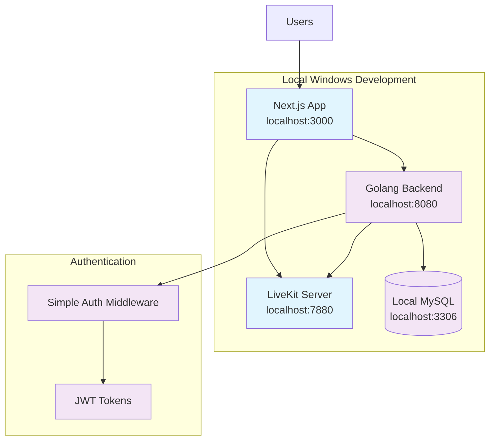
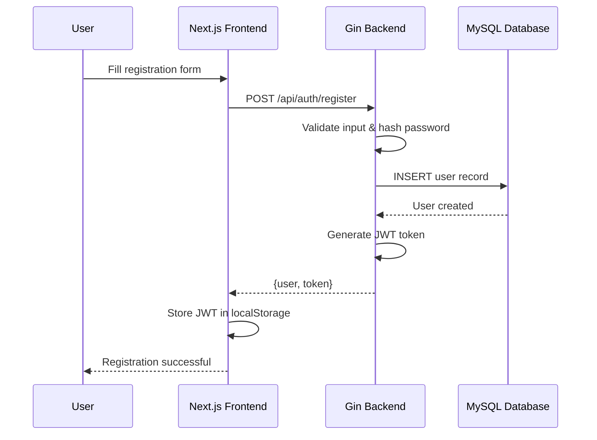
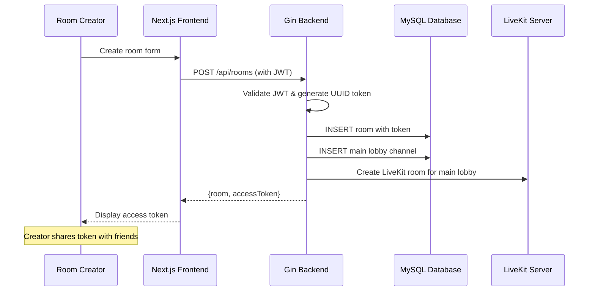
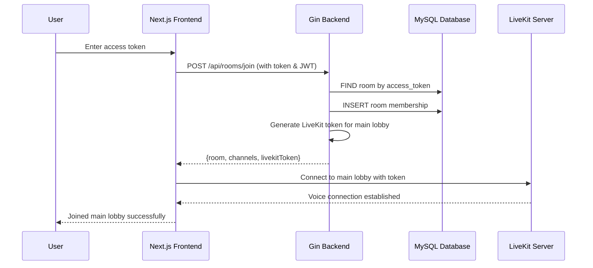
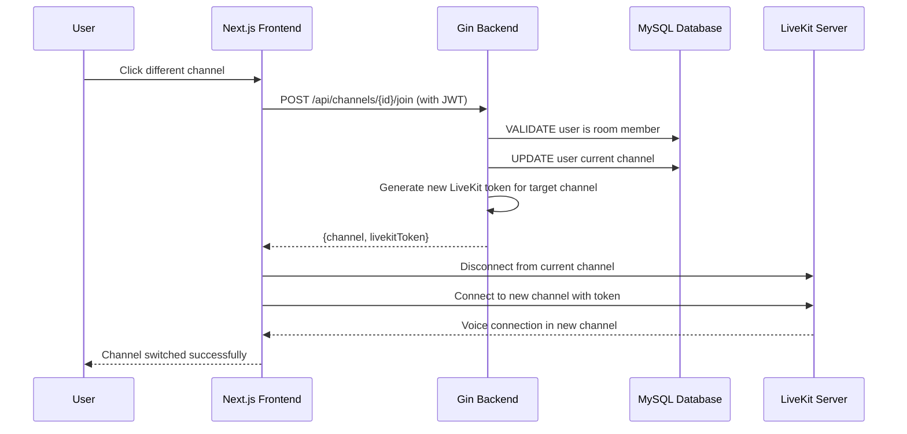
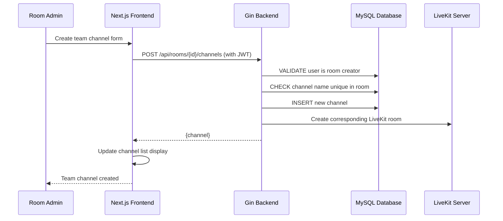

# LiveKit Meet Gaming Voice Chat Platform Fullstack Architecture

## Introduction

This document outlines the complete fullstack architecture for **LiveKit Meet Gaming Voice Chat Platform**, including backend systems, frontend implementation, and their integration. It serves as the single source of truth for AI-driven development, ensuring consistency across the entire technology stack.

This unified approach combines what would traditionally be separate backend and frontend architecture documents, streamlining the development process for this modern fullstack application where these concerns are increasingly intertwined.

### Starter Template or Existing Project

**Analysis**: This is a **brownfield enhancement project** based on existing LiveKit Meet codebase.

**Existing Project Constraints:**
- **Base Project**: LiveKit Meet (video conferencing app)
- **Current Tech Stack**: Next.js 15.2.4, React 18.3.1, TypeScript 5.9.2, LiveKit Components
- **Architecture Pattern**: Next.js App Router with React Server Components
- **Deployment**: Local Windows development environment
- **LiveKit Integration**: Local LiveKit server (livekit-server.exe) instead of LiveKit Cloud

**Architectural Decisions Already Made:**
- Frontend framework: Next.js with App Router (cannot be changed)
- Type system: TypeScript with strict mode
- Package manager: PNPM 10.9.0
- Voice/video infrastructure: LiveKit (must be preserved)
- Build system: Next.js with custom webpack configuration

**What Can Be Modified vs Retained:**
- ✅ **Can Add**: New Golang backend service
- ✅ **Can Add**: MySQL database for user/room management
- ✅ **Can Extend**: Next.js frontend with new gaming features
- ❌ **Must Retain**: All existing LiveKit Meet functionality
- ❌ **Must Retain**: Current Next.js App Router structure
- ❌ **Must Retain**: LiveKit integration patterns

### Change Log

| Date | Version | Description | Author |
|------|---------|-------------|--------|
| 2025-09-19 | 1.0 | Initial fullstack architecture for gaming voice chat enhancement | Winston (Architect) |

## High Level Architecture

### Technical Summary

LiveKit Meet Gaming Voice Chat Platform employs a **local fullstack architecture** combining the existing Next.js frontend with a new Golang backend service, while using a local LiveKit server instance for real-time voice communication. The frontend maintains the current App Router pattern but extends it with simple authentication and room management UI that communicates with the local Golang backend APIs. The Golang backend handles user authentication, hierarchical room management (gaming rooms → channels), and local MySQL persistence, while delegating actual voice/video communication to the local LiveKit server. This architecture achieves the PRD goals by adding essential business logic on top of existing voice quality, enabling token-based room access, user accounts, and team-based voice channels while maintaining simplicity and running entirely on your local Windows development environment.

### Platform and Infrastructure Choice

**Platform**: Local Windows Development Environment
**Key Services**: Next.js (localhost:3000), Golang Backend (localhost:8080), MySQL (localhost:3306), LiveKit Server (localhost:7880)
**Deployment Host and Regions**: Local development only - no cloud deployment

**Local Setup Requirements:**
- ✅ Next.js development server (existing)
- ✅ Golang installed on Windows (ready)
- ✅ MySQL installed on Windows (ready)
- ✅ LiveKit Server executable for Windows (livekit-server.exe)

### Repository Structure

**Structure**: Extended monorepo within existing LiveKit Meet repository
**Monorepo Tool**: Native PNPM workspaces (already in use)
**Package Organization**:
- `/app` - Existing Next.js frontend (extended with gaming features)
- `/backend` - New Golang backend service
- `/lib` - Existing shared utilities (extended with backend types)

This approach builds on your existing structure while adding a simple backend directory for the Golang service.

### High Level Architecture Diagram



### Architectural Patterns

- **Simple Fullstack Pattern:** Next.js frontend + Golang backend on same machine - _Rationale:_ Minimal complexity for local development and testing

- **Component-Based UI:** React components for basic room management - _Rationale:_ Extends existing LiveKit Meet patterns without gaming-specific optimizations

- **Basic Repository Pattern:** Simple database access for user/room data - _Rationale:_ Clean separation between business logic and data access

- **REST API Pattern:** Simple Golang HTTP server for backend operations - _Rationale:_ Straightforward API design for basic authentication and room management

- **Local Service Integration:** Direct communication between local services - _Rationale:_ No network latency or cloud complexity, suitable for development and simple deployment

- **Basic State Management:** Frontend React state + backend MySQL persistence - _Rationale:_ Simple state management without gaming-specific performance optimizations

## Tech Stack

### Technology Stack Table

| Category | Technology | Version | Purpose | Rationale |
|----------|------------|---------|---------|-----------|
| Frontend Language | TypeScript | 5.9.2 | Type-safe frontend development | Already established in existing codebase |
| Frontend Framework | Next.js | 15.2.4 | React-based web application | Existing framework, proven App Router patterns |
| UI Component Library | LiveKit Components React | 2.9.14 | Voice/video UI components | Existing integration, proven voice chat UI |
| State Management | React useState/Context | Built-in | Local component state management | Simple state needs, no complex gaming state |
| Backend Language | Go | 1.21+ | Backend service development | Installed on Windows, excellent performance |
| Backend Framework | Gin | 1.9+ | HTTP web framework for Go | Popular, simple REST API framework |
| API Style | REST | HTTP/1.1 | Client-server communication | Simple request/response for basic features |
| Database | MySQL | 8.0+ | User and room data persistence | Installed on Windows, reliable relational DB |
| Cache | None | N/A | No caching layer needed | Simple application, local development |
| File Storage | Local filesystem | N/A | Static assets and uploads | Local development, no cloud storage |
| Authentication | JWT | Go-JWT v4 | Stateless user authentication | Simple token-based auth for REST APIs |
| Frontend Testing | Vitest | 3.2.4 | Unit testing for React components | Already configured in existing project |
| Backend Testing | Go testing | Built-in | Unit testing for Go services | Standard Go testing framework |
| E2E Testing | None | N/A | No E2E testing initially | Keep development simple |
| Build Tool | Next.js | 15.2.4 | Frontend build and dev server | Existing build configuration |
| Bundler | Webpack | Built-in | Module bundling via Next.js | Next.js default, already configured |
| IaC Tool | None | N/A | No infrastructure as code | Local development only |
| CI/CD | None | N/A | No continuous deployment | Local development environment |
| Monitoring | Console logging | Built-in | Basic application logging | Simple console output for debugging |
| Logging | Standard library | Built-in | Go log package for backend | Basic logging for local development |
| CSS Framework | CSS Modules | Built-in | Component-scoped styling | Existing pattern in LiveKit Meet |
| Voice/Video | LiveKit Server | 1.5+ | Local WebRTC infrastructure | Local livekit-server.exe for voice chat |
| Database Driver | go-sql-driver/mysql | 1.7+ | MySQL connectivity for Go | Standard MySQL driver for Go |
| HTTP Router | Gin Router | Built-in | REST API routing | Part of Gin framework |
| CORS Handler | Gin CORS | 1.4+ | Cross-origin request handling | Enable frontend-backend communication |
| Environment Config | godotenv | 1.4+ | Environment variable management | Simple .env file handling for Go |

## Data Models

### User

**Purpose:** Represents authenticated users who can create and join gaming chat rooms

**Key Attributes:**
- id: uint (primary key) - Unique user identifier
- username: string - Display name for gaming
- email: string - User email for authentication
- password_hash: string - Securely hashed password
- created_at: timestamp - Account creation time
- updated_at: timestamp - Last profile update

#### TypeScript Interface
```typescript
interface User {
  id: number;
  username: string;
  email: string;
  createdAt: string;
  updatedAt: string;
}

interface UserRegistration {
  username: string;
  email: string;
  password: string;
}

interface UserLogin {
  email: string;
  password: string;
}
```

#### Relationships
- One user can create many gaming rooms (one-to-many with Room)
- One user can join many gaming rooms (many-to-many through RoomMember)
- One user can be in one channel at a time (one-to-one with current channel)

### Room

**Purpose:** Represents gaming chat rooms with unique access tokens and hierarchical channel structure

**Key Attributes:**
- id: uint (primary key) - Unique room identifier
- name: string - Room display name
- access_token: string - UUID token for joining room
- creator_id: uint - Foreign key to User who created room
- created_at: timestamp - Room creation time
- is_active: boolean - Whether room is currently active

#### TypeScript Interface
```typescript
interface Room {
  id: number;
  name: string;
  accessToken: string;
  creatorId: number;
  createdAt: string;
  isActive: boolean;
  creator?: User;
  channels?: Channel[];
  members?: User[];
}

interface RoomCreation {
  name: string;
}

interface RoomJoin {
  accessToken: string;
}
```

#### Relationships
- One room belongs to one creator (many-to-one with User)
- One room has many channels including main lobby (one-to-many with Channel)
- One room has many members (many-to-many through RoomMember)

### Channel

**Purpose:** Represents voice channels within gaming rooms (main lobby + admin-created team channels)

**Key Attributes:**
- id: uint (primary key) - Unique channel identifier
- name: string - Channel display name
- room_id: uint - Foreign key to parent Room
- is_main_lobby: boolean - Whether this is the default main lobby
- livekit_room_name: string - Corresponding LiveKit room identifier
- created_at: timestamp - Channel creation time

#### TypeScript Interface
```typescript
interface Channel {
  id: number;
  name: string;
  roomId: number;
  isMainLobby: boolean;
  livekitRoomName: string;
  createdAt: string;
  room?: Room;
  currentUsers?: User[];
}

interface ChannelCreation {
  name: string;
  roomId: number;
}
```

#### Relationships
- One channel belongs to one room (many-to-one with Room)
- One channel can have many users currently connected (one-to-many with UserChannel)
- One channel maps to one LiveKit room for voice separation

### RoomMember

**Purpose:** Junction table tracking which users are members of which gaming rooms

**Key Attributes:**
- id: uint (primary key) - Unique membership identifier
- user_id: uint - Foreign key to User
- room_id: uint - Foreign key to Room
- joined_at: timestamp - When user joined the room
- is_active: boolean - Whether membership is currently active

#### TypeScript Interface
```typescript
interface RoomMember {
  id: number;
  userId: number;
  roomId: number;
  joinedAt: string;
  isActive: boolean;
}
```

#### Relationships
- Links User and Room in many-to-many relationship
- Tracks room membership history and status

### UserChannel

**Purpose:** Tracks which channel each user is currently in for voice separation

**Key Attributes:**
- id: uint (primary key) - Unique connection identifier
- user_id: uint - Foreign key to User
- channel_id: uint - Foreign key to Channel
- connected_at: timestamp - When user joined this channel
- livekit_participant_id: string - LiveKit participant identifier

#### TypeScript Interface
```typescript
interface UserChannel {
  id: number;
  userId: number;
  channelId: number;
  connectedAt: string;
  livekitParticipantId: string;
  user?: User;
  channel?: Channel;
}
```

#### Relationships
- One user can be in one channel at a time (one-to-one active relationship)
- One channel can have many users currently connected (one-to-many)
- Maps to LiveKit participant for voice communication

## API Specification

### REST API Specification

```yaml
openapi: 3.0.0
info:
  title: Gaming Voice Chat API
  version: 1.0.0
  description: Simple REST API for gaming voice chat with token-based room access
servers:
  - url: http://localhost:8080
    description: Local development server

paths:
  # Authentication Endpoints
  /api/auth/register:
    post:
      summary: Register new user account
      requestBody:
        required: true
        content:
          application/json:
            schema:
              type: object
              properties:
                username:
                  type: string
                  minLength: 3
                email:
                  type: string
                  format: email
                password:
                  type: string
                  minLength: 6
              required: [username, email, password]
      responses:
        201:
          description: User registered successfully
          content:
            application/json:
              schema:
                type: object
                properties:
                  user:
                    $ref: '#/components/schemas/User'
                  token:
                    type: string
        400:
          description: Invalid input or user already exists

  /api/auth/login:
    post:
      summary: User login
      requestBody:
        required: true
        content:
          application/json:
            schema:
              type: object
              properties:
                email:
                  type: string
                  format: email
                password:
                  type: string
              required: [email, password]
      responses:
        200:
          description: Login successful
          content:
            application/json:
              schema:
                type: object
                properties:
                  user:
                    $ref: '#/components/schemas/User'
                  token:
                    type: string
        401:
          description: Invalid credentials

  # Room Management Endpoints
  /api/rooms:
    post:
      summary: Create new gaming room
      security:
        - BearerAuth: []
      requestBody:
        required: true
        content:
          application/json:
            schema:
              type: object
              properties:
                name:
                  type: string
                  minLength: 1
              required: [name]
      responses:
        201:
          description: Room created successfully
          content:
            application/json:
              schema:
                type: object
                properties:
                  room:
                    $ref: '#/components/schemas/Room'
                  accessToken:
                    type: string
                    format: uuid

  /api/rooms/join:
    post:
      summary: Join room using access token
      security:
        - BearerAuth: []
      requestBody:
        required: true
        content:
          application/json:
            schema:
              type: object
              properties:
                accessToken:
                  type: string
                  format: uuid
              required: [accessToken]
      responses:
        200:
          description: Successfully joined room
          content:
            application/json:
              schema:
                type: object
                properties:
                  room:
                    $ref: '#/components/schemas/RoomWithChannels'
                  livekitToken:
                    type: string
        404:
          description: Invalid access token

  /api/rooms/{roomId}/channels:
    post:
      summary: Create team channel (admin only)
      security:
        - BearerAuth: []
      parameters:
        - name: roomId
          in: path
          required: true
          schema:
            type: integer
      requestBody:
        required: true
        content:
          application/json:
            schema:
              type: object
              properties:
                name:
                  type: string
                  minLength: 1
              required: [name]
      responses:
        201:
          description: Channel created successfully
          content:
            application/json:
              schema:
                $ref: '#/components/schemas/Channel'
        403:
          description: Only room creator can create channels
        409:
          description: Channel name already exists in this room

  /api/channels/{channelId}/join:
    post:
      summary: Switch to different channel
      security:
        - BearerAuth: []
      parameters:
        - name: channelId
          in: path
          required: true
          schema:
            type: integer
      responses:
        200:
          description: Successfully switched channel
          content:
            application/json:
              schema:
                type: object
                properties:
                  channel:
                    $ref: '#/components/schemas/Channel'
                  livekitToken:
                    type: string
        403:
          description: User not member of room containing this channel

components:
  securitySchemes:
    BearerAuth:
      type: http
      scheme: bearer
      bearerFormat: JWT

  schemas:
    User:
      type: object
      properties:
        id:
          type: integer
        username:
          type: string
        email:
          type: string
        createdAt:
          type: string
          format: date-time

    Room:
      type: object
      properties:
        id:
          type: integer
        name:
          type: string
        creatorId:
          type: integer
        createdAt:
          type: string
          format: date-time

    RoomWithChannels:
      allOf:
        - $ref: '#/components/schemas/Room'
        - type: object
          properties:
            channels:
              type: array
              items:
                $ref: '#/components/schemas/Channel'

    Channel:
      type: object
      properties:
        id:
          type: integer
        name:
          type: string
        roomId:
          type: integer
        isMainLobby:
          type: boolean
        livekitRoomName:
          type: string
        createdAt:
          type: string
          format: date-time
```

## Components

### Frontend Components

#### Authentication Component
**Responsibility:** Handle user registration, login, and authentication state management for the gaming platform

**Key Interfaces:**
- `/auth/login` - Login form with email/password validation
- `/auth/register` - Registration form with username/email/password
- `useAuth()` - React hook for authentication state and operations

**Dependencies:**
- Golang backend REST API for authentication endpoints
- React Context for global auth state
- Next.js router for authentication redirects

**Technology Stack:** React functional components, TypeScript, Next.js App Router, JWT token storage in localStorage

#### Room Management Component
**Responsibility:** Handle gaming room creation, token sharing, and room joining functionality

**Key Interfaces:**
- `/rooms/create` - Room creation form with name input
- `/rooms/join` - Token input form for room joining
- `useRoom()` - React hook for current room state and operations

**Dependencies:**
- Authentication Component for user context
- Golang backend API for room operations
- Channel Navigation Component for room display

**Technology Stack:** React components, TypeScript interfaces, REST API integration, form validation

#### Channel Navigation Component
**Responsibility:** Display room hierarchy and handle voice channel switching within gaming rooms

**Key Interfaces:**
- Channel list sidebar with main lobby and team channels
- Channel switching buttons with real-time user indicators
- Admin controls for team channel creation (room creators only)

**Dependencies:**
- Room Management Component for current room context
- LiveKit Components for voice connection state
- Golang backend API for channel operations

**Technology Stack:** React components, LiveKit React hooks, CSS modules for styling

#### LiveKit Integration Component
**Responsibility:** Manage voice/video communication using existing LiveKit patterns extended for channel-based rooms

**Key Interfaces:**
- Voice connection management per channel
- LiveKit token handling from backend
- Audio controls and participant display

**Dependencies:**
- Existing LiveKit Meet components (preserved)
- Channel Navigation Component for channel switching
- Local LiveKit server for voice communication

**Technology Stack:** Existing LiveKit Components React, LiveKit Client SDK, extended with channel context

### Backend Components

#### Authentication Service
**Responsibility:** Handle user registration, login, JWT token generation and validation

**Key Interfaces:**
- `POST /api/auth/register` - User registration with password hashing
- `POST /api/auth/login` - User authentication with JWT generation
- `AuthMiddleware()` - JWT token validation for protected routes

**Dependencies:**
- MySQL database for user storage
- bcrypt for password hashing
- JWT library for token operations

**Technology Stack:** Gin HTTP handlers, go-jwt library, bcrypt, MySQL driver

#### Room Management Service
**Responsibility:** Handle gaming room creation, access token generation, and room membership management

**Key Interfaces:**
- `POST /api/rooms` - Create room with UUID token generation
- `POST /api/rooms/join` - Join room using access token
- `RoomRepository` - Database operations for room entities

**Dependencies:**
- Authentication Service for user validation
- MySQL database for room persistence
- UUID library for token generation
- LiveKit Service for room coordination

**Technology Stack:** Gin HTTP handlers, MySQL database operations, UUID generation, repository pattern

#### Channel Management Service
**Responsibility:** Handle team channel creation, channel switching, and LiveKit room coordination

**Key Interfaces:**
- `POST /api/rooms/{id}/channels` - Create team channels (admin only)
- `POST /api/channels/{id}/join` - Switch user between channels
- `ChannelRepository` - Database operations for channel entities

**Dependencies:**
- Room Management Service for room validation
- LiveKit Service for voice room management
- MySQL database for channel persistence

**Technology Stack:** Gin HTTP handlers, database repository pattern, LiveKit integration

#### LiveKit Service
**Responsibility:** Interface with local LiveKit server for voice room management and token generation

**Key Interfaces:**
- `CreateLiveKitRoom()` - Create voice rooms for channels
- `GenerateLiveKitToken()` - Generate access tokens for voice participation
- `ManageParticipant()` - Handle user voice connection state

**Dependencies:**
- Local LiveKit server (livekit-server.exe)
- LiveKit Server SDK for Go
- Channel Management Service for room mapping

**Technology Stack:** LiveKit Server SDK, Go HTTP client, local server integration

## Core Workflows

### User Registration and Authentication Flow



### Room Creation and Token Sharing Flow



### Room Joining and Voice Connection Flow



### Channel Switching Flow



### Team Channel Creation Flow (Admin Only)



## Database Schema

```sql
-- Database schema for Gaming Voice Chat Platform
-- MySQL 8.0+ with InnoDB engine

-- Users table
CREATE TABLE users (
    id INT UNSIGNED AUTO_INCREMENT PRIMARY KEY,
    username VARCHAR(50) NOT NULL UNIQUE,
    email VARCHAR(100) NOT NULL UNIQUE,
    password_hash VARCHAR(255) NOT NULL,
    created_at TIMESTAMP DEFAULT CURRENT_TIMESTAMP,
    updated_at TIMESTAMP DEFAULT CURRENT_TIMESTAMP ON UPDATE CURRENT_TIMESTAMP,

    INDEX idx_username (username),
    INDEX idx_email (email)
) ENGINE=InnoDB DEFAULT CHARSET=utf8mb4 COLLATE=utf8mb4_unicode_ci;

-- Rooms table
CREATE TABLE rooms (
    id INT UNSIGNED AUTO_INCREMENT PRIMARY KEY,
    name VARCHAR(100) NOT NULL,
    access_token CHAR(36) NOT NULL UNIQUE, -- UUID format
    creator_id INT UNSIGNED NOT NULL,
    is_active BOOLEAN DEFAULT TRUE,
    created_at TIMESTAMP DEFAULT CURRENT_TIMESTAMP,

    FOREIGN KEY (creator_id) REFERENCES users(id) ON DELETE CASCADE,
    INDEX idx_access_token (access_token),
    INDEX idx_creator (creator_id),
    INDEX idx_active (is_active)
) ENGINE=InnoDB DEFAULT CHARSET=utf8mb4 COLLATE=utf8mb4_unicode_ci;

-- Channels table
CREATE TABLE channels (
    id INT UNSIGNED AUTO_INCREMENT PRIMARY KEY,
    name VARCHAR(50) NOT NULL,
    room_id INT UNSIGNED NOT NULL,
    is_main_lobby BOOLEAN DEFAULT FALSE,
    livekit_room_name VARCHAR(100) NOT NULL,
    created_at TIMESTAMP DEFAULT CURRENT_TIMESTAMP,

    FOREIGN KEY (room_id) REFERENCES rooms(id) ON DELETE CASCADE,
    UNIQUE KEY unique_channel_per_room (room_id, name),
    UNIQUE KEY unique_main_lobby_per_room (room_id, is_main_lobby),
    INDEX idx_room_channels (room_id),
    INDEX idx_livekit_room (livekit_room_name)
) ENGINE=InnoDB DEFAULT CHARSET=utf8mb4 COLLATE=utf8mb4_unicode_ci;

-- Room memberships junction table
CREATE TABLE room_members (
    id INT UNSIGNED AUTO_INCREMENT PRIMARY KEY,
    user_id INT UNSIGNED NOT NULL,
    room_id INT UNSIGNED NOT NULL,
    joined_at TIMESTAMP DEFAULT CURRENT_TIMESTAMP,
    is_active BOOLEAN DEFAULT TRUE,

    FOREIGN KEY (user_id) REFERENCES users(id) ON DELETE CASCADE,
    FOREIGN KEY (room_id) REFERENCES rooms(id) ON DELETE CASCADE,
    UNIQUE KEY unique_active_membership (user_id, room_id, is_active),
    INDEX idx_user_rooms (user_id),
    INDEX idx_room_members (room_id),
    INDEX idx_active_memberships (is_active)
) ENGINE=InnoDB DEFAULT CHARSET=utf8mb4 COLLATE=utf8mb4_unicode_ci;

-- User current channel tracking
CREATE TABLE user_channels (
    id INT UNSIGNED AUTO_INCREMENT PRIMARY KEY,
    user_id INT UNSIGNED NOT NULL,
    channel_id INT UNSIGNED NOT NULL,
    connected_at TIMESTAMP DEFAULT CURRENT_TIMESTAMP,
    livekit_participant_id VARCHAR(100),

    FOREIGN KEY (user_id) REFERENCES users(id) ON DELETE CASCADE,
    FOREIGN KEY (channel_id) REFERENCES channels(id) ON DELETE CASCADE,
    UNIQUE KEY one_channel_per_user (user_id), -- User can only be in one channel
    INDEX idx_channel_users (channel_id),
    INDEX idx_livekit_participant (livekit_participant_id)
) ENGINE=InnoDB DEFAULT CHARSET=utf8mb4 COLLATE=utf8mb4_unicode_ci;

-- Additional indexes for performance optimization
ALTER TABLE room_members ADD INDEX idx_user_room_active (user_id, room_id, is_active);
ALTER TABLE user_channels ADD INDEX idx_active_channel_users (channel_id, connected_at);
ALTER TABLE rooms ADD INDEX idx_created_active (created_at, is_active);
```

## Frontend Architecture

### Component Organization
```text
app/
├── (auth)/                      # Authentication route group
│   ├── login/
│   │   └── page.tsx            # Login page
│   └── register/
│       └── page.tsx            # Registration page
├── (dashboard)/                 # Protected dashboard routes
│   ├── create-room/
│   │   └── page.tsx            # Room creation page
│   └── join-room/
│       └── page.tsx            # Room joining page
├── rooms/
│   └── [roomId]/
│       └── page.tsx            # Gaming room interface (extended)
├── api/                         # Existing Next.js API routes (preserved)
├── layout.tsx                   # Root layout (extended with auth)
└── page.tsx                     # Home page (modified for gaming)

lib/
├── auth/                        # Authentication utilities
│   ├── AuthContext.tsx         # React context for auth state
│   ├── useAuth.ts              # Authentication hook
│   └── authService.ts          # API calls for auth
├── gaming/                      # Gaming-specific components
│   ├── RoomCreator.tsx         # Room creation component
│   ├── RoomJoiner.tsx          # Room joining component
│   ├── ChannelSidebar.tsx      # Channel navigation
│   └── useRoom.ts              # Room state management hook
├── api/                         # Backend API integration
│   ├── apiClient.ts            # HTTP client configuration
│   └── endpoints.ts            # API endpoint definitions
└── (existing LiveKit components preserved)
```

### State Management Architecture
- **React Context + useReducer**: Authentication state management
- **Custom Hooks**: Room and channel state with local state and API integration
- **LiveKit State**: Managed by existing LiveKit components (preserved)
- **Local Storage**: JWT token persistence across browser sessions

### API Client Setup
```typescript
class ApiClient {
  private baseURL = 'http://localhost:8080';

  private async request<T>(endpoint: string, options: RequestInit = {}): Promise<T> {
    const token = localStorage.getItem('auth-token');

    const response = await fetch(`${this.baseURL}${endpoint}`, {
      headers: {
        'Content-Type': 'application/json',
        ...(token && { Authorization: `Bearer ${token}` }),
        ...options.headers,
      },
      ...options,
    });

    if (!response.ok) {
      throw new Error(`API Error: ${response.status}`);
    }

    return response.json();
  }
}
```

## Backend Architecture

### Service Architecture
```text
backend/
├── cmd/
│   └── server/
│       └── main.go             # Application entry point
├── internal/
│   ├── handlers/               # HTTP request handlers
│   │   ├── auth.go            # Authentication endpoints
│   │   ├── rooms.go           # Room management endpoints
│   │   └── channels.go        # Channel management endpoints
│   ├── services/              # Business logic layer
│   │   ├── auth_service.go    # Authentication business logic
│   │   ├── room_service.go    # Room management logic
│   │   ├── channel_service.go # Channel management logic
│   │   └── livekit_service.go # LiveKit integration
│   ├── repositories/          # Data access layer
│   │   ├── user_repo.go       # User database operations
│   │   ├── room_repo.go       # Room database operations
│   │   └── channel_repo.go    # Channel database operations
│   ├── models/                # Data models
│   ├── middleware/            # HTTP middleware
│   └── config/               # Configuration
├── pkg/                      # Public packages
└── go.mod                    # Go module definition
```

### Authentication Middleware
```go
func AuthMiddleware(jwtService *jwt.Service) gin.HandlerFunc {
    return func(c *gin.Context) {
        authHeader := c.GetHeader("Authorization")
        if authHeader == "" {
            c.JSON(http.StatusUnauthorized, gin.H{"error": "Authorization header required"})
            c.Abort()
            return
        }

        tokenString := strings.TrimPrefix(authHeader, "Bearer ")

        claims, err := jwtService.ValidateToken(tokenString)
        if err != nil {
            c.JSON(http.StatusUnauthorized, gin.H{"error": "Invalid token"})
            c.Abort()
            return
        }

        c.Set("userID", claims.UserID)
        c.Set("email", claims.Email)
        c.Next()
    }
}
```

## Unified Project Structure

```plaintext
livekit-meet-gaming/                  # Extended existing repository
├── .github/                          # Existing CI/CD workflows (preserved)
├── app/                              # Next.js App Router (existing, extended)
│   ├── (auth)/                       # New authentication route group
│   ├── api/                          # Existing Next.js API routes (preserved)
│   ├── rooms/                        # Extended room functionality
│   ├── layout.tsx                    # Root layout (extended with auth)
│   └── page.tsx                      # Home page (enhanced for gaming)
├── backend/                          # New Golang backend service
│   ├── cmd/server/main.go           # Golang application entry point
│   ├── internal/                    # Internal packages
│   │   ├── handlers/                # HTTP request handlers
│   │   ├── services/               # Business logic layer
│   │   ├── repositories/           # Data access layer
│   │   ├── models/                 # Data models
│   │   ├── middleware/             # HTTP middleware
│   │   └── config/                # Configuration
│   ├── scripts/                    # Database and setup scripts
│   ├── .env.example               # Backend environment template
│   ├── go.mod                     # Go module definition
│   └── go.sum                     # Go module checksums
├── lib/                             # Extended existing utilities
│   ├── auth/                       # New authentication utilities
│   ├── gaming/                     # New gaming components
│   ├── api/                        # New API integration
│   └── (existing LiveKit components preserved)
├── docs/                           # Documentation
│   ├── prd.md                     # Gaming enhancement PRD
│   ├── brownfield-architecture.md # Existing system analysis
│   └── architecture.md           # This fullstack architecture
├── scripts/                        # Build and development scripts
├── .env.example                    # Frontend environment template
├── package.json                    # Frontend dependencies (existing)
└── README.md                       # Updated project documentation
```

## Development Workflow

### Prerequisites
```bash
# Required software (already installed per user)
# - Node.js 18+
# - Golang 1.21+
# - MySQL 8.0+
# - LiveKit Server executable (livekit-server.exe)
# - PNPM package manager
```

### Development Commands
```bash
# Start all services (from project root)
./scripts/start-services.sh

# Or start services individually:
pnpm dev                              # Start frontend
cd backend && go run cmd/server/main.go  # Start backend
livekit-server --dev --bind 0.0.0.0 --port 7880  # Start LiveKit server
```

### Environment Configuration
```bash
# Frontend (.env.local)
NEXT_PUBLIC_API_URL=http://localhost:8080
NEXT_PUBLIC_LIVEKIT_URL=ws://localhost:7880
NEXT_PUBLIC_APP_ENV=development

# Backend (.env)
DB_HOST=localhost
DB_PORT=3306
DB_USER=root
DB_PASSWORD=your_mysql_password
DB_NAME=livekit_gaming

JWT_SECRET=your-secret-key-here
JWT_EXPIRES_IN=24h

LIVEKIT_API_KEY=devkey
LIVEKIT_API_SECRET=secret
LIVEKIT_HOST=localhost:7880

PORT=8080
GIN_MODE=debug
```

---

*This fullstack architecture document serves as the comprehensive blueprint for implementing gaming voice chat features on top of the existing LiveKit Meet infrastructure. All development should follow these patterns and constraints to ensure successful integration and maintainable code.*