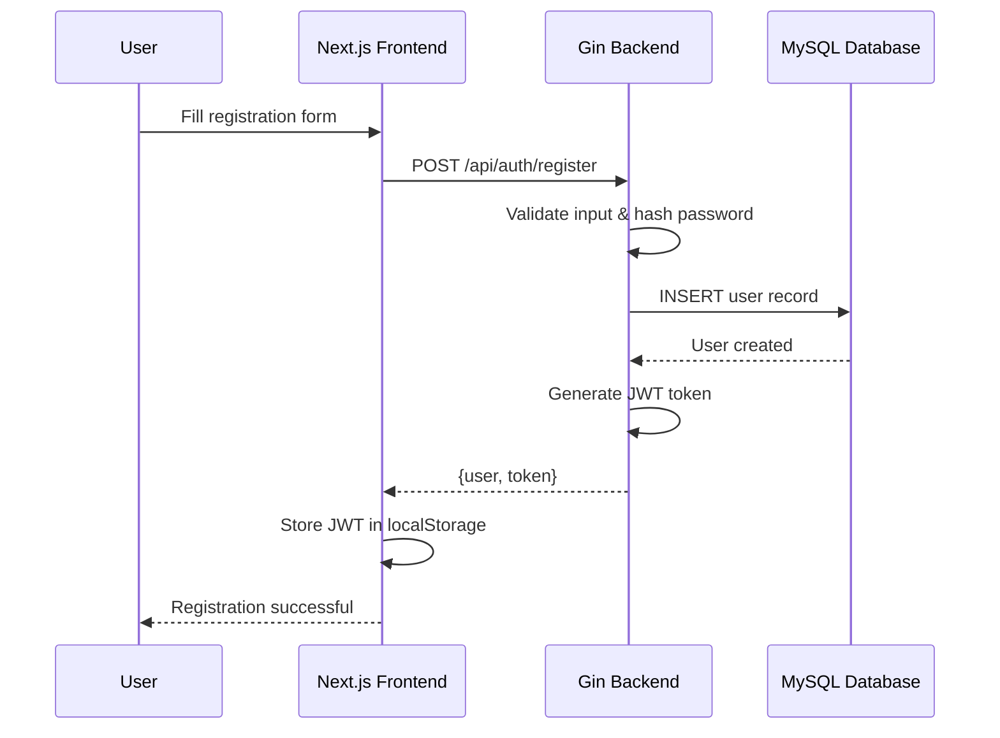
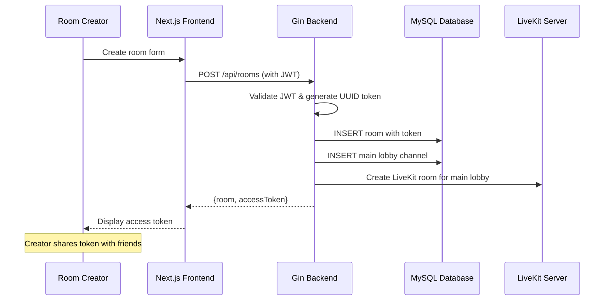
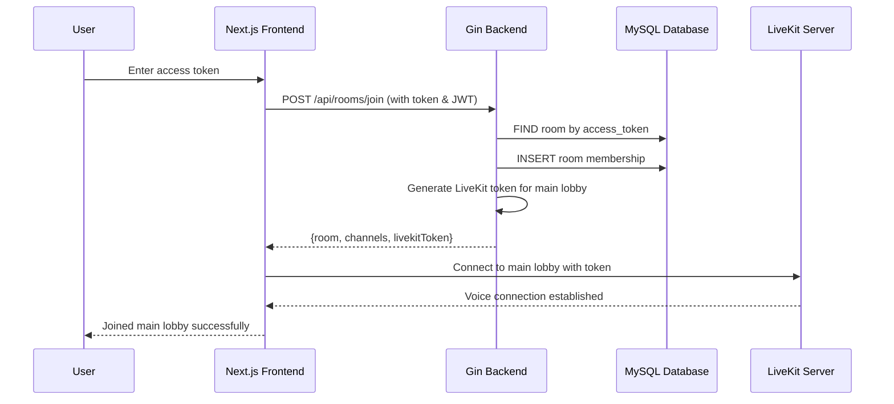
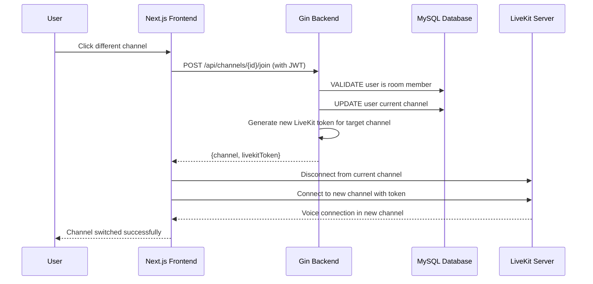
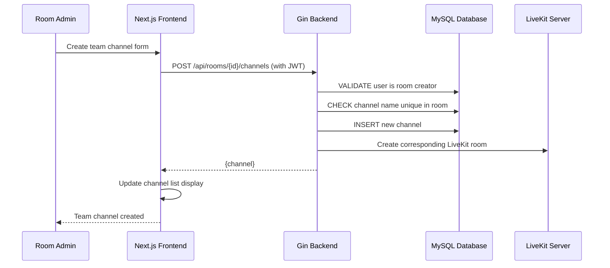

# Core Workflows

### User Registration and Authentication Flow

### Room Creation and Token Sharing Flow

### Room Joining and Voice Connection Flow

### Channel Switching Flow

### Team Channel Creation Flow (Admin Only)


