# High Level Architecture

### Technical Summary

LiveKit Meet Gaming Voice Chat Platform employs a **local fullstack architecture** combining the existing Next.js frontend with a new Golang backend service, while using a local LiveKit server instance for real-time voice communication. The frontend maintains the current App Router pattern but extends it with simple authentication and room management UI that communicates with the local Golang backend APIs. The Golang backend handles user authentication, hierarchical room management (gaming rooms → channels), and local MySQL persistence, while delegating actual voice/video communication to the local LiveKit server. This architecture achieves the PRD goals by adding essential business logic on top of existing voice quality, enabling token-based room access, user accounts, and team-based voice channels while maintaining simplicity and running entirely on your local Windows development environment.

### Platform and Infrastructure Choice

**Platform**: Local Windows Development Environment
**Key Services**: Next.js (localhost:3000), Golang Backend (localhost:8080), MySQL (localhost:3306), LiveKit Server (localhost:7880)
**Deployment Host and Regions**: Local development only - no cloud deployment

**Local Setup Requirements:**
- ✅ Next.js development server (existing)
- ✅ Golang installed on Windows (ready)
- ✅ MySQL installed on Windows (ready)
- ✅ LiveKit Server executable for Windows (livekit-server.exe)

### Repository Structure

**Structure**: Extended monorepo within existing LiveKit Meet repository
**Monorepo Tool**: Native PNPM workspaces (already in use)
**Package Organization**:
- `/app` - Existing Next.js frontend (extended with gaming features)
- `/backend` - New Golang backend service
- `/lib` - Existing shared utilities (extended with backend types)

This approach builds on your existing structure while adding a simple backend directory for the Golang service.

### High Level Architecture Diagram

```mermaid
graph TB
    User[Users]

    subgraph "Local Windows Development"
        Web[Next.js App<br/>localhost:3000]
        API[Golang Backend<br/>localhost:8080]
        LK[LiveKit Server<br/>localhost:7880]
        DB[(Local MySQL<br/>localhost:3306)]
    end

    subgraph "Authentication"
        JWT[JWT Tokens]
        Auth[Simple Auth Middleware]
    end

    User --> Web
    Web --> API
    Web --> LK
    API --> DB
    API --> Auth
    API --> LK
    Auth --> JWT

    classDef existing fill:#e1f5fe
    classDef new fill:#f3e5f5

    class Web,LK existing
    class API,DB,JWT,Auth new
```

### Architectural Patterns

- **Simple Fullstack Pattern:** Next.js frontend + Golang backend on same machine - _Rationale:_ Minimal complexity for local development and testing

- **Component-Based UI:** React components for basic room management - _Rationale:_ Extends existing LiveKit Meet patterns without gaming-specific optimizations

- **Basic Repository Pattern:** Simple database access for user/room data - _Rationale:_ Clean separation between business logic and data access

- **REST API Pattern:** Simple Golang HTTP server for backend operations - _Rationale:_ Straightforward API design for basic authentication and room management

- **Local Service Integration:** Direct communication between local services - _Rationale:_ No network latency or cloud complexity, suitable for development and simple deployment

- **Basic State Management:** Frontend React state + backend MySQL persistence - _Rationale:_ Simple state management without gaming-specific performance optimizations

