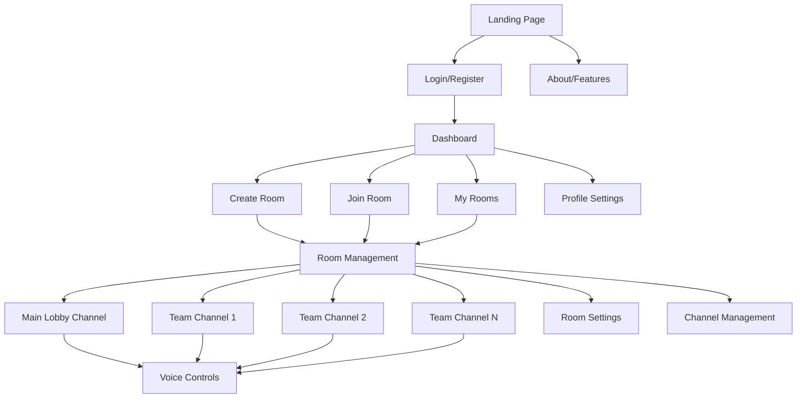
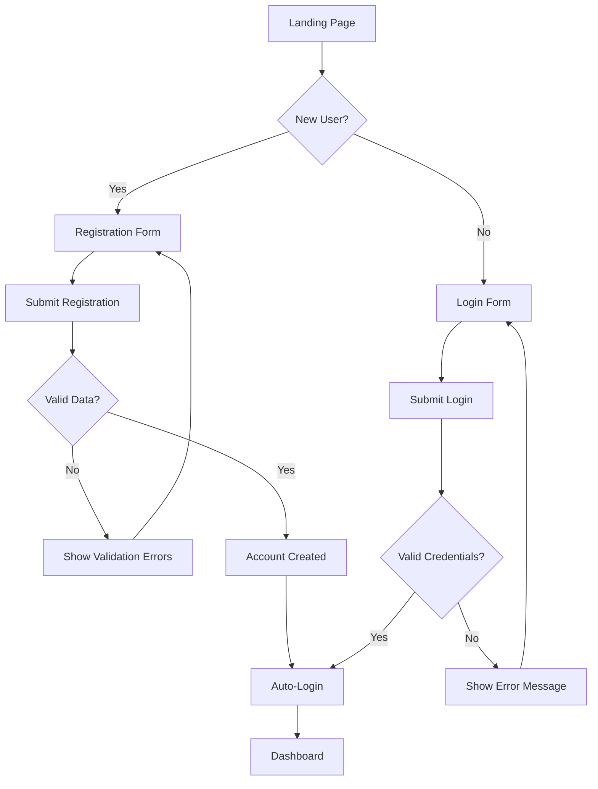
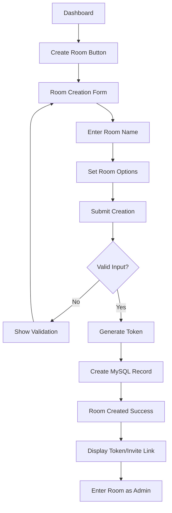
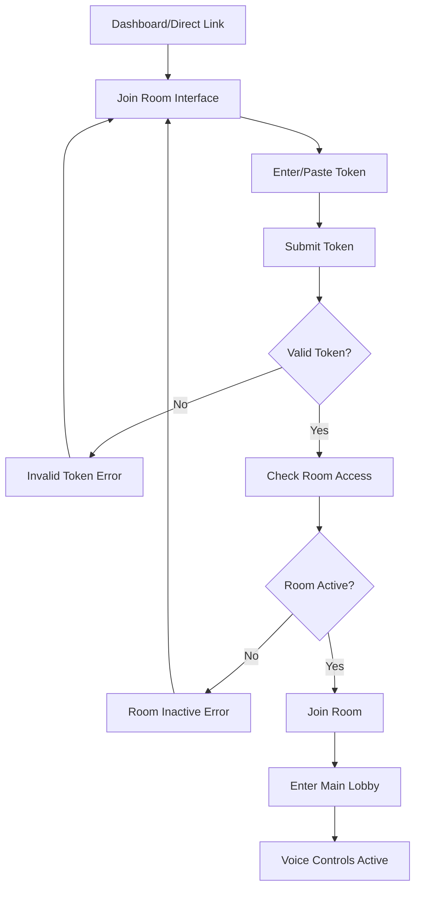

# Gaming Voice Chat Platform UI/UX Specification

This document defines the user experience goals, information architecture, user flows, and visual design specifications for the Gaming Voice Chat Platform's user interface. It serves as the foundation for visual design and frontend development, ensuring a cohesive and user-centered experience.

## Overall UX Goals & Principles

### Target User Personas

**Primary Gamer:** Competitive gamers who need reliable voice communication during matches with easy channel switching and minimal latency.

**Casual Gaming Groups:** Friends who game together regularly and need persistent room structures they can return to for different gaming sessions.

**Room Administrator:** Gaming team leaders who need to create and manage team channels, control access, and organize their gaming community.

### Usability Goals

- **Quick Room Access:** Users can join a gaming room using a token within 10 seconds
- **Simple Channel Switching:** Clear visual indication of current channel with easy click-to-switch
- **Glanceable Status:** Users can quickly see who's in which channels when they tab back
- **Persistent State:** Users can leave and rejoin rooms/channels without losing context or position
- **Set-and-Forget Operation:** Once set up, minimal interaction needed during gaming sessions

### Design Principles

1. **Background-First Interface** - Clean, simple interface that works well when users briefly tab back from games
2. **Minimal Attention Design** - Clear visual states that users can quickly glance at and understand
3. **Simple Interaction Patterns** - Basic click-to-join channels, no complex controls or shortcuts needed
4. **Persistent Identity** - Users maintain consistent identity and preferences across gaming sessions
5. **Team-Oriented Structure** - Interface emphasizes team organization and channel hierarchy

### Change Log

| Date | Version | Description | Author |
|------|---------|-------------|--------|
| 2025-09-19 | 1.0 | Initial UI/UX specification creation | Sally (UX Expert) |

## Information Architecture (IA)

### Site Map / Screen Inventory

### Navigation Structure

**Primary Navigation:** Simple top navigation with Dashboard, Create Room, Join Room, and user profile dropdown. Persistent navigation across all authenticated screens.

**Secondary Navigation:** Within rooms: channel list sidebar showing Main Lobby + Team Channels. Room-level controls: Settings, Invite Users, Leave Room.

**Breadcrumb Strategy:** Minimal breadcrumbs: Dashboard > Room Name > Channel Name. Always show current room and channel context.

## User Flows

### User Registration & Login Flow

**User Goal:** Create an account and access the gaming voice chat platform

**Entry Points:** Landing page, direct link to login/register

**Success Criteria:** User successfully authenticates and reaches dashboard

#### Flow Diagram

#### Edge Cases & Error Handling:
- Username/email already exists during registration
- Invalid password format
- Network connectivity issues during authentication
- Session timeout handling

**Notes:** Auto-login after registration reduces friction for new users

### Create Gaming Room Flow

**User Goal:** Create a new gaming room with unique access token

**Entry Points:** Dashboard "Create Room" button

**Success Criteria:** Room created successfully with shareable token generated

#### Flow Diagram

#### Edge Cases & Error Handling:
- Room name already exists (for user)
- Database connection failure during creation
- Token generation collision (retry mechanism)

**Notes:** Token should be easily shareable via copy/paste

### Join Room via Token Flow

**User Goal:** Join an existing gaming room using access token

**Entry Points:** Dashboard "Join Room" button, direct token link

**Success Criteria:** User successfully joins room and enters Main Lobby channel

#### Flow Diagram

#### Edge Cases & Error Handling:
- Expired or invalid tokens
- Room at maximum capacity
- User already in another room (conflict handling)
- Network issues during room connection

**Notes:** Direct token links should work for easy sharing

## Wireframes & Mockups

**Primary Design Files:** Custom gaming-focused frontend architecture leveraging LiveKit components where beneficial, but designed specifically for our gaming use case.

### Key Screen Layouts

#### Gaming Dashboard (`app/dashboard/page.tsx` - new design)

**Purpose:** Gaming-first landing page after authentication, completely replacing the meeting-style homepage

**Key Elements:**
- Large "Create Gaming Room" button with room name input
- "Join Room" section with prominent token input field
- "My Active Rooms" grid showing rooms with user counts and activity status
- Recent gaming sessions list
- User profile with gaming preferences
- Clean, dark gaming aesthetic

**Interaction Notes:** Fast room creation and joining - no unnecessary meeting features

**Design File Reference:** New `styles/GamingDashboard.module.css` with dark theme focus

#### Voice Channel Room (`app/rooms/[roomName]/page.tsx` - complete redesign)

**Purpose:** Main gaming voice interface - channels on left, minimal center area, users on right

**Key Elements:**
- **Left Sidebar:** Channel list (Main Lobby + Team Channels) with join/leave controls
- **Center Area:** Current channel name, room controls, invite link display
- **Right Sidebar:** User list with voice indicators using LiveKit `AudioVisualizer`
- **Bottom Bar:** Voice controls using LiveKit `TrackToggle` components (mute/unmute)
- Channel admin controls for room creators

**Interaction Notes:** One-click channel switching, persistent voice state, minimal interface

**Design File Reference:** New `styles/VoiceRoom.module.css` optimized for gaming

#### Authentication Pages (`app/auth/login` & `app/auth/register` - new)

**Purpose:** Simple gaming-focused auth, completely replacing any meeting-style auth

**Key Elements:**
- Clean login/register forms
- Gaming branding and messaging
- Quick registration flow
- "Remember me" for gaming convenience

**Interaction Notes:** Fast auth to get to gaming quickly

**Design File Reference:** New `styles/Auth.module.css`

### Reusable LiveKit Components We'll Keep:

- `AudioVisualizer` - for voice activity indicators
- `TrackToggle` - for mute/unmute controls
- `useRoomContext`, `useParticipants` - for room state management
- `ConnectionQualityIndicator` - for connection status
- Audio processing components for voice quality

### Original Meet Components We'll Ditch:

- Video-focused components (Camera settings, video displays)
- Meeting-style UI layouts and navigation
- Screen sharing components
- Recording indicators (unless we want this for gaming)
- Settings menus designed for meetings

## Component Library / Design System

**Design System Approach:** Create a custom gaming-focused design system built on top of select LiveKit components. We'll establish our own visual language optimized for gaming while leveraging LiveKit's proven audio/voice functionality.

### Core Components

#### GamingButton Component

**Purpose:** Primary action buttons for room creation, joining, and navigation

**Variants:**
- Primary (Create Room, Join Room)
- Secondary (Leave Channel, Settings)
- Danger (Leave Room, Delete Room)

**States:** Default, Hover, Active, Disabled, Loading

**Usage Guidelines:** Use primary for main actions, secondary for navigation, danger for destructive actions. Always include loading state for async operations.

#### ChannelList Component

**Purpose:** Display hierarchical list of voice channels with user counts and activity

**Variants:**
- Main Lobby (always present)
- Team Channels (admin-created)
- Private Channels (future feature)

**States:** Active, Inactive, Joining, Full, Admin-only

**Usage Guidelines:** Main Lobby always visible at top, Team Channels grouped below. Show user count and voice activity indicators.

#### VoiceUserCard Component

**Purpose:** Display user in voice channel with speaking indicators and controls

**Variants:**
- Self (current user with additional controls)
- Other Users (basic display)
- Admin (with admin badges)

**States:** Speaking, Muted, Deafened, Away, Disconnected

**Usage Guidelines:** Integrate LiveKit `AudioVisualizer` for speaking animation. Show connection quality with LiveKit `ConnectionQualityIndicator`.

#### TokenInput Component

**Purpose:** Special input field for room access tokens with validation

**Variants:**
- Standard input
- QR code scanner (future)
- Link paste detection

**States:** Empty, Valid, Invalid, Checking, Success

**Usage Guidelines:** Auto-validate token format, provide clear error messages, support paste detection for invite links.

#### RoomStatusCard Component

**Purpose:** Display room overview with member count and activity status

**Variants:**
- Active Room (green indicators)
- Idle Room (yellow indicators)
- Admin Room (with management controls)

**States:** Online, Idle, Full, Private, Error

**Usage Guidelines:** Show in dashboard grid layout, include quick join action, display last activity time.

## Branding & Style Guide

**Brand Guidelines:** Create a gaming-first brand that emphasizes reliability, performance, and team communication for competitive gaming.

### Visual Identity

### Color Palette

| Color Type | Hex Code | Usage |
|-----------|----------|-------|
| Primary | #7C3AED | Call-to-action buttons, active states, highlights |
| Secondary | #1F2937 | Backgrounds, cards, containers |
| Accent | #10B981 | Success states, online indicators, positive feedback |
| Success | #059669 | Confirmations, successful connections, online status |
| Warning | #F59E0B | Cautions, connection issues, important notices |
| Error | #EF4444 | Errors, disconnections, destructive actions |
| Neutral | #6B7280, #374151, #111827 | Text, borders, subtle backgrounds |

### Typography

#### Font Families
- **Primary:** Inter (clean, modern, excellent readability for gaming UIs)
- **Secondary:** JetBrains Mono (for tokens, technical text, code-like elements)
- **Monospace:** JetBrains Mono (consistent with secondary)

#### Type Scale

| Element | Size | Weight | Line Height |
|---------|------|--------|-------------|
| H1 | 2rem (32px) | 700 (Bold) | 1.2 |
| H2 | 1.5rem (24px) | 600 (Semi-bold) | 1.3 |
| H3 | 1.25rem (20px) | 600 (Semi-bold) | 1.4 |
| Body | 1rem (16px) | 400 (Regular) | 1.6 |
| Small | 0.875rem (14px) | 400 (Regular) | 1.5 |

### Iconography

**Icon Library:** Lucide React - consistent, gaming-friendly icons with excellent React support

**Usage Guidelines:** Use outline style icons for consistency. Icons should be 16px or 24px for optimal clarity. Voice-related icons (mic, speaker, headphones) should be immediately recognizable.

### Spacing & Layout

**Grid System:** CSS Grid and Flexbox for responsive layouts, no complex grid framework needed

**Spacing Scale:** 4px base unit (4px, 8px, 12px, 16px, 24px, 32px, 48px, 64px) for consistent spacing throughout the interface

## Accessibility Requirements

### Compliance Target

**Standard:** WCAG 2.1 AA compliance - industry standard that ensures broad accessibility without excessive implementation burden

### Key Requirements

**Visual:**
- Color contrast ratios: 4.5:1 for normal text, 3:1 for large text (essential for gaming environments with varied lighting)
- Focus indicators: 2px solid outline with high contrast color for keyboard navigation
- Text sizing: Support browser zoom up to 200% without horizontal scrolling

**Interaction:**
- Keyboard navigation: Full app functionality accessible via keyboard (Tab, Enter, Escape, Arrow keys)
- Screen reader support: Proper ARIA labels for all voice controls, channel states, and user status
- Touch targets: Minimum 44x44px for mobile users accessing via phones/tablets

**Content:**
- Alternative text: Descriptive alt text for user avatars, status icons, and connection indicators
- Heading structure: Logical H1-H6 hierarchy for screen reader navigation
- Form labels: Clear, descriptive labels for all inputs including token fields

### Testing Strategy

**Automated Testing:** Integrate axe-core with existing Vitest setup for automated accessibility testing during development

**Manual Testing:** Keyboard-only navigation testing and screen reader testing with NVDA/JAWS for voice communication features

**User Testing:** Test with gamers who use assistive technologies, especially for voice communication workflows

## Responsiveness Strategy

### Breakpoints

| Breakpoint | Min Width | Max Width | Target Devices |
|-----------|-----------|-----------|----------------|
| Mobile | 320px | 767px | Phones (quick status checks, emergency channel switching) |
| Tablet | 768px | 1023px | Tablets (secondary devices, mobile gaming setups) |
| Desktop | 1024px | 1439px | Standard gaming monitors, laptops |
| Wide | 1440px | - | Ultrawide monitors, multi-monitor gaming setups |

### Adaptation Patterns

**Layout Changes:**
- Mobile: Single column layout, collapsible channel sidebar, bottom navigation for voice controls
- Tablet: Two-column layout with channel list and main content, persistent voice controls
- Desktop: Three-column layout (channels, main content, user list) optimized for quick glancing
- Wide: Enhanced spacing, larger user avatars, potential for additional gaming integrations

**Navigation Changes:**
- Mobile: Hamburger menu for channels, modal overlays for room management
- Tablet: Persistent channel sidebar, simplified navigation header
- Desktop: Full sidebar navigation, comprehensive header with all controls
- Wide: Expanded navigation areas, potential for gaming status integration

**Content Priority:**
- Mobile: Voice controls and current channel status prioritized, minimal secondary information
- Tablet: Current channel focus with easy access to channel switching
- Desktop: Full information hierarchy, all features accessible simultaneously
- Wide: Enhanced visual feedback, room for additional contextual information

**Interaction Changes:**
- Mobile: Touch-optimized controls, swipe gestures for channel switching
- Tablet: Mixed touch and precision interactions
- Desktop: Mouse and keyboard optimized, hover states for detailed information
- Wide: Enhanced hover interactions, space for additional controls

## Animation & Micro-interactions

### Motion Principles

**Subtle and Functional:** Animations should be purposeful and subtle - providing clear feedback about voice states, connection status, and user actions without being distracting during gaming sessions

**Accessibility Aware:** Respect `prefers-reduced-motion` settings and provide alternative feedback methods for users who disable animations

### Key Animations

- **Voice Activity Pulse:** Subtle glow animation around user avatars when speaking (Duration: 200ms, Easing: ease-in-out)
- **Channel Switch Transition:** Smooth fade between channel states (Duration: 150ms, Easing: ease-out)
- **Connection Status Change:** Color transition for connection indicators (Duration: 300ms, Easing: ease-in-out)
- **Button Hover States:** Subtle scale and color transitions (Duration: 100ms, Easing: ease-out)
- **Loading States:** Minimal spinner for token validation and room joining (Duration: continuous, Easing: linear)
- **Toast Notifications:** Slide-in from top for connection events (Duration: 250ms, Easing: ease-out)
- **Modal Fade:** Background overlay and content fade-in (Duration: 200ms, Easing: ease-in-out)
- **Sidebar Collapse:** Smooth width transition for mobile menu (Duration: 250ms, Easing: ease-in-out)

## Performance Considerations

### Performance Goals

- **Page Load:** Under 3 seconds on standard broadband connections
- **Interaction Response:** Under 100ms for basic UI interactions
- **Animation FPS:** Smooth 60fps for all animations and transitions

### Design Strategies

Focus on optimized component rendering and efficient state management using React best practices and LiveKit's optimized hooks for real-time communication.

## Next Steps

### Immediate Actions

1. Review specification with development team for technical feasibility
2. Create initial component prototypes for core gaming functionality
3. Set up development environment with gaming-focused styling approach
4. Begin implementation of authentication and room management features
5. Integrate LiveKit components for voice communication functionality

### Design Handoff Checklist

- [x] All user flows documented
- [x] Component inventory complete
- [x] Accessibility requirements defined
- [x] Responsive strategy clear
- [x] Brand guidelines incorporated
- [x] Performance goals established

## Checklist Results

This document provides comprehensive UI/UX specifications for transforming LiveKit Meet into a gaming voice chat platform. All major sections have been covered with gaming-specific considerations while leveraging existing LiveKit infrastructure for reliable voice communication.
